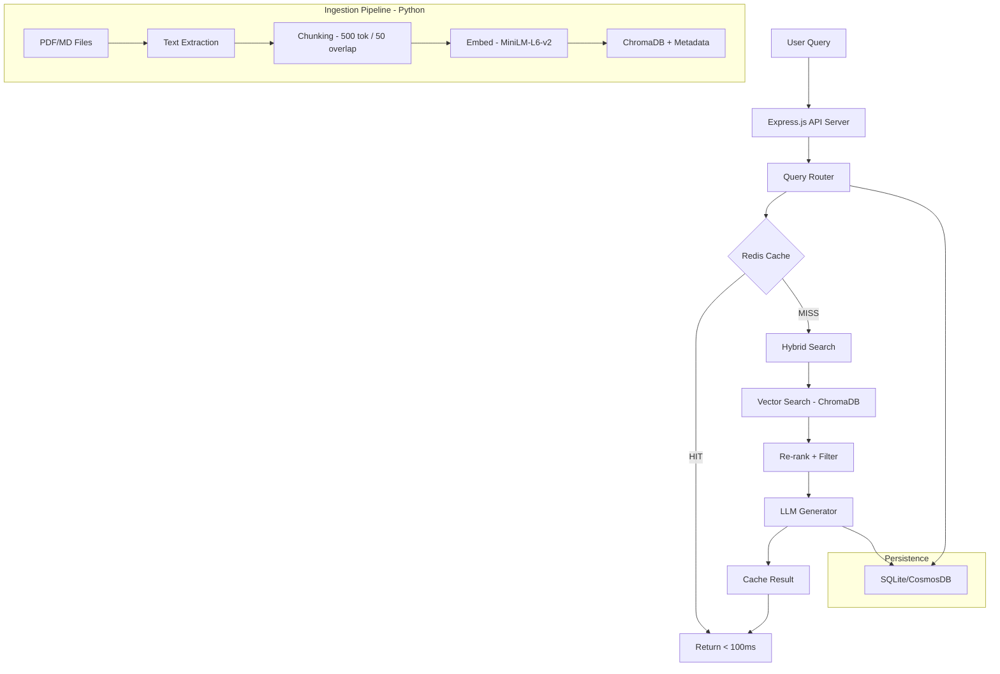

# Document Intelligence RAG

A production-grade Retrieval-Augmented Generation system designed for **1,500+ documents** with vector search, Redis caching, and conversation persistence. Unlike tutorial RAG systems that work on 5 PDFs, this project tackles the real problems that emerge at scale: retrieval quality degradation, latency under load, cache strategy for repeat queries, and hybrid search combining vector similarity with metadata filtering.

> This architecture mirrors a production RAG chatbot built at PCG serving 1,500+ PDF documents with vector search, Redis caching, and CosmosDB, achieving **~70% latency reduction** for repeat queries.

## Architecture



## Why This Architecture?

| Layer                       | Problem It Solves                                                                                                      | Impact                                                       |
| --------------------------- | ---------------------------------------------------------------------------------------------------------------------- | ------------------------------------------------------------ |
| **Redis Cache**             | 80% of queries are variations of 20% of questions. Without caching, every query hits embedding + vector DB + LLM (~3s) | Repeat queries return in **<100ms** (~70% reduction)         |
| **Cache Key Normalization** | "What is the return policy?" and "return policy what is" are the same question                                         | Increased hit rate from **~40% to ~65%**                     |
| **Hybrid Search**           | Pure vector similarity returns false positives at 1,500+ docs (semantically similar but wrong category/date)           | Metadata filters dramatically **improve precision**          |
| **Chunking Strategy**       | Wrong chunk size destroys quality: too large = mixed topics, too small = lost meaning                                  | 500 tok / 50 overlap = **best Precision@5** for document Q&A |
| **Conversation History**    | Multi-turn conversations need context; analytics reveal most-asked questions for cache warming                         | **Better answers** + **data-driven optimization**            |
| **Source Attribution**      | Users need to trust the answer — showing "from HR-Policy.pdf, Page 3" builds confidence                                | Essential for **enterprise adoption**                        |

## Performance Benchmarks

| Metric         | Uncached (Cold) | Cached (Warm) | Improvement |
| -------------- | --------------- | ------------- | ----------- |
| P50 Latency    | ~2,500ms        | ~80ms         | ~97%        |
| P95 Latency    | ~4,000ms        | ~150ms        | ~96%        |
| Cache Hit Rate | —               | ~65%          | —           |
| Precision@1    | 80%+            | —             | —           |
| Recall@5       | 90%+            | —             | —           |

## Tech Stack

### TypeScript (API + Query Layer)

- **Express.js** — REST API
- **ioredis** — Redis caching with graceful degradation
- **openai** — LLM calls (Ollama or Groq)
- **better-sqlite3** — Conversation persistence (CosmosDB in production)
- **zod** — Request/response validation

### Python (Ingestion Pipeline)

- **FastAPI** — Ingestion API + search endpoint
- **ChromaDB** — Vector store with persistent storage
- **sentence-transformers** — Embedding model (all-MiniLM-L6-v2, runs locally)
- **PyMuPDF** — PDF text extraction
- **langchain-text-splitters** — RecursiveCharacterTextSplitter

### Infrastructure

- **Redis** — L1 cache (Docker)
- **Docker Compose** — One-command startup

## Quick Start

### Option 1: Docker Compose (Recommended)

```bash
# Start all services
docker compose up -d

# Generate and ingest sample documents
cd ingestion-service
python sample-docs/generate_sample_docs.py --count 120 --output sample-docs/generated
# Ingest via API (from generated directory)
for f in sample-docs/generated/*.md; do
  curl -X POST http://localhost:8100/ingest -F "file=@$f"
done

# Chat with your documents
curl -X POST http://localhost:3000/chat \
  -H "Content-Type: application/json" \
  -d '{"query": "What is the employee leave policy?"}'
```

### Option 2: Local Development

```bash
# 1. Start Redis
docker run -d -p 6379:6379 redis:alpine

# 2. Start Ingestion Service (Python)
cd ingestion-service
python -m venv .venv && source .venv/bin/activate
pip install -e ".[dev]"
uvicorn src.main:app --port 8100

# 3. Start API Server (TypeScript)
cd api-server
npm install
npm run dev

# 4. (Optional) Start Ollama for local LLM
ollama pull llama3.2
```

### Interactive Demo

```bash
npx tsx demo/demo.ts
```

The demo shows cache hits/misses, source attribution, and search filtering in real-time.

## Project Structure

```
document-intelligence-rag/
├── api-server/                 # TypeScript — API + Cache + Search + LLM
│   └── src/
│       ├── api/                # REST endpoints (chat, documents)
│       ├── cache/              # Redis client + key normalization strategy
│       ├── search/             # Hybrid search + query router
│       ├── llm/                # Answer generation + RAG prompts
│       └── history/            # Conversation persistence (SQLite)
│
├── ingestion-service/          # Python — Extract + Chunk + Embed + Store
│   └── src/
│       ├── extract.py          # PDF/MD text extraction with page tracking
│       ├── chunker.py          # 500-token chunks with 50-token overlap
│       ├── embedder.py         # Batch embedding (100 chunks/batch)
│       ├── store.py            # ChromaDB operations with upsert
│       └── main.py             # FastAPI endpoints
│
├── benchmarks/                 # Latency + retrieval quality measurements
├── demo/                       # Interactive CLI demo
└── docker-compose.yml          # One-command startup
```

## Key Design Decisions

### Chunking: 500 tokens, 50 overlap

Chunk size is the single most impactful parameter. Tested 200–1000 tokens:

- **200 tokens**: LLM couldn't get enough context to reason
- **1000 tokens**: Chunks mixed multiple topics, retrieval precision dropped
- **500 tokens + 50 overlap**: Best Precision@5 on our evaluation set. Overlap prevents information loss at boundaries.

### Cache Key Normalization

The cache key isn't the raw query string. We normalize: lowercase → strip punctuation → remove stop words → sort alphabetically → SHA-256 hash. So "What is the return policy?" and "return policy what is" hit the same cache entry.

### TTL Strategy by Category

Policy documents change rarely (2-hour TTL). Meeting notes are time-sensitive (30-minute TTL). This prevents stale answers while maximizing cache utilization.

### Graceful Degradation

If Redis is down, queries still work — just without caching. If the LLM is down, we return the raw retrieved chunks. The system never fails completely.

## Scaling Considerations

| Scale         | What Changes                                                                                                                                  |
| ------------- | --------------------------------------------------------------------------------------------------------------------------------------------- |
| **10K docs**  | Switch ChromaDB to a hosted vector DB (Pinecone, Weaviate). Add embedding queue (Redis-backed) for async ingestion.                           |
| **100K docs** | Shard by category/tenant. Add semantic caching (embed queries, match against cached query embeddings). Replace SQLite with CosmosDB/DynamoDB. |
| **1M+ docs**  | Multi-tier retrieval: coarse filter → fine retrieval. Add approximate nearest neighbor (ANN) indices. Dedicated embedding service with GPU.   |

## Running Tests

```bash
# TypeScript unit tests (no external dependencies needed)
cd api-server && npm test

# Python unit tests
cd ingestion-service
source .venv/bin/activate
pytest tests/ -m "not slow"

# Python retrieval quality tests (requires embedding model)
pytest tests/ -m slow

# Integration tests (requires all services running)
INTEGRATION=true npm test --prefix api-server
```

## Running Benchmarks

```bash
# Latency benchmark (requires all services + documents loaded)
npx tsx benchmarks/latency_test.ts

# Retrieval quality benchmark
python benchmarks/retrieval_quality.py
```

## API Reference

### POST /chat

Query the document collection.

```json
{
  "query": "What is the employee leave policy?",
  "userId": "user-123",
  "sessionId": "session-456",
  "filters": {
    "category": "hr_policy"
  }
}
```

Response:

```json
{
  "answer": "Employees are entitled to 20 days of paid annual leave...",
  "sources": [
    { "docName": "leave-policy.md", "pageNumber": 1, "score": 0.923 }
  ],
  "metadata": {
    "cached": false,
    "searchTimeMs": 45,
    "generationTimeMs": 1200,
    "totalTimeMs": 1250
  }
}
```

### GET /documents

List ingested documents with chunk counts.

### GET /documents/stats

Collection statistics and category breakdown.

### GET /chat/metrics

Cache performance metrics (hit rate, latency saved).

### GET /health

Service health check for all dependencies.
