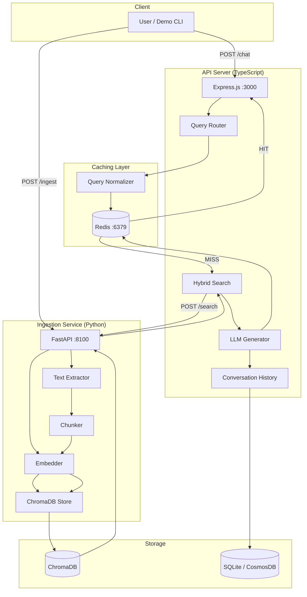

# Architecture

## System Overview



## Query Flow (Detailed)

```
1. User sends query: "What is the leave policy?"
   │
2. Query Router receives request
   │
3. Cache Check:
   ├─ Normalize: "What is the leave policy?"
   │    → lowercase: "what is the leave policy"
   │    → strip punctuation: "what is the leave policy"
   │    → remove stop words: "leave policy"
   │    → sort: "leave policy"
   │    → SHA-256: "rag:query:a3f2..."
   │
   ├─ Redis GET "rag:query:a3f2..."
   │    ├─ HIT → return cached response (< 100ms)
   │    └─ MISS → continue to step 4
   │
4. Hybrid Search:
   ├─ Embed query → 384-dim vector
   ├─ ChromaDB: find top-20 by cosine similarity
   ├─ Apply metadata filters (category, date)
   ├─ Re-rank for diversity (penalize same doc+page)
   └─ Return top-5 chunks
   │
5. LLM Generation:
   ├─ Build prompt: system instructions + context chunks + history
   ├─ Call LLM (Ollama/Groq) with temperature=0.3
   └─ Parse response with source citations
   │
6. Cache Store:
   ├─ Redis SETEX with category-based TTL
   │    ├─ Policies: 2 hours
   │    ├─ Meeting notes: 30 minutes
   │    └─ Default: 1 hour
   │
7. Persist:
   ├─ Save to conversation history (SQLite/CosmosDB)
   └─ Return answer + sources + performance metadata
```

## Ingestion Flow

```
1. File uploaded to POST /ingest
   │
2. Extract:
   ├─ PDF → PyMuPDF (page-by-page, preserving reading order)
   ├─ Markdown/Text → per-line parsing with synthetic pages
   └─ Output: list of (page_number, text) pairs
   │
3. Chunk:
   ├─ RecursiveCharacterTextSplitter
   ├─ 500 chars per chunk, 50 char overlap
   ├─ Split hierarchy: paragraphs → sentences → words
   └─ Each chunk tagged with (doc_name, page_number, chunk_index)
   │
4. Metadata:
   ├─ Auto-detect category from filename + content
   ├─ Extract tags (year, version, file type)
   └─ Attach to each chunk for filtered search
   │
5. Embed:
   ├─ sentence-transformers all-MiniLM-L6-v2
   ├─ Batch size: 100 (3-5x throughput vs single)
   ├─ Normalized vectors (cosine = dot product)
   └─ Output: list of 384-dim float vectors
   │
6. Store:
   ├─ ChromaDB upsert (deterministic IDs for dedup)
   └─ Persistent storage (data survives restarts)
```

## Data Flow Between Services

| From | To | Protocol | Purpose |
|------|----|----------|---------|
| User → API Server | HTTP POST | Query or ingest |
| API Server → Redis | TCP (Redis protocol) | Cache check/store |
| API Server → Ingestion Service | HTTP POST /search | Vector search |
| API Server → LLM (Ollama/Groq) | HTTP POST (OpenAI-compatible) | Answer generation |
| API Server → SQLite | Local file I/O | Conversation persistence |
| Ingestion Service → ChromaDB | Python API (in-process) | Vector store operations |
